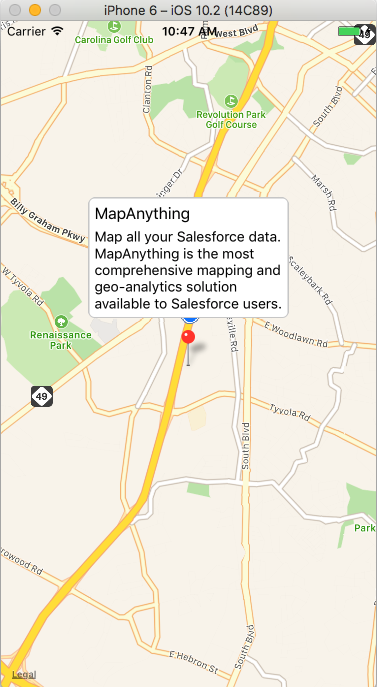

# React-Native Simple Map

A simple map created with React-Native for iOS and Android with the following features:

- iOS & Android Apps based on [React-Native](https://facebook.github.io/react-native).
- Uses [React Native Maps](https://github.com/airbnb/react-native-maps) by AirBnb.
- Makes a request to the [Google Maps Geocoding API](https://developers.google.com/maps/documentation/geocoding/intro).

### iOS

